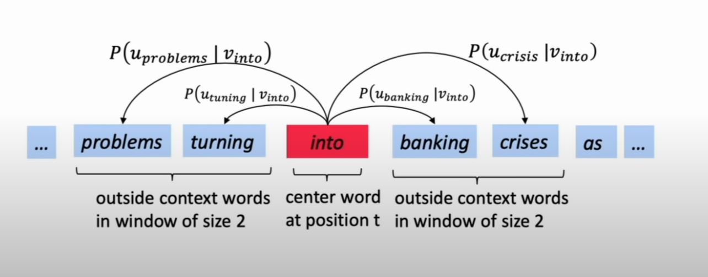

# Lecture 1: Introduction and Word Vectors

## Course Info

Website Link: http://web.stanford.edu/class/cs224n/index.html

Video Link: https://www.youtube.com/watch?v=8rXD5-xhemo&list=PLoROMvodv4rOhcuXMZkNm7j3fVwBBY42z&index=1&ab_channel=stanfordonline

There are 5 assignments with this course & Final Project.

HW1 - IPython  
HW2: Numpy  
HW3: PyTorch  
HW4 and HW5: PyTorch on GPU (Microsoft Azure)  

## Introduction to NLP

Human Language is glorious chaos. 

Symbol <=> Idea

In traditional NLP: we regard words as discrete symbols (one-hot vectors)  
Problems with this approach:
1) Size of Vector becomes too big with large vocabulary
2) Any two vectors are orthogonal, therefore, there is no natural notion of similarity for one-hot vectors; building a word similarity table is too costly in memory

<b> "You should know the meaning of a word by the company it keeps" </b> (Distributional Semantics)

This is where word vectors come in (word embeddings).

## Word2Vec

<b> from additional resources: http://mccormickml.com/2016/04/19/word2vec-tutorial-the-skip-gram-model/ </b>

Original word2vec Paper: https://arxiv.org/pdf/1301.3781.pdf

Negative Sampling Paper: https://proceedings.neurips.cc/paper/2013/file/9aa42b31882ec039965f3c4923ce901b-Paper.pdf

Framework for learning word vectors. Mikolov in 2013 opened the flood gates for word vectors.  
Idea:
1) Have Large Corpus of text (large body of text)
2) Every word in a fixed vocabulary is represented with a vector
3) Go through each position <i>t</i> in the text, which has a center word <i>c</i> and context ("outside") words <i>o</i>
4) Use similarity of word vectors for c and o to calculate the probability of <i>o</i> given <i>c</i> (or vice versa)
5) Keep adjusting word vectors to maximize this probability

Likelihood function: P(wt+j, wt; \theta)  
Theta is all variables to be optimized   
Cost function: is the (average) negative log likelihood of probability of likelihood function

  

Training a model, we adjust parameters to minimize a loss:
1) We start the vectors by randomly initializing the vector and then ...
2) Compute all vector gradients (we optimize these parameters by walking down the gradient)
3) Remember: every word has two vectors