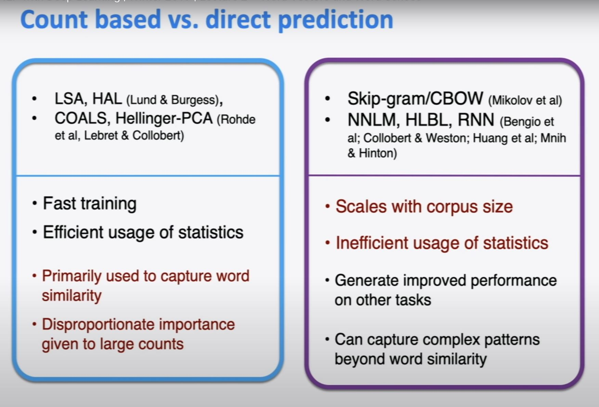

# Lecture 2: Word Vectors and Word Senses

## Course Info

Website Link: http://web.stanford.edu/class/cs224n/index.html

Video Link: https://www.youtube.com/watch?v=kEMJRjEdNzM&list=PLoROMvodv4rOhcuXMZkNm7j3fVwBBY42z&index=2&ab_channel=stanfordonline

## Exploring Word Vectors

A problem that we encounter is that one word can have more than one meaning. And a simple name such as "Clinton" can 
be associated with former president even in the context of referring it your friend 

We want a model that gives a reasonably high probability 
estimate to all words that occur in the context (fairly often)

In high dimensional spaces a word can be very close to another word.

## Optimization

small steps in the directions of negative gradient descent. alpha(learning rate) to determine how small a step to take. 
We want to do Stochastic Gradient Descent and not "wait a very long time before making a single update" 

## Word Vectors 

There are two model variants:
1) Skip-grams (SG) (what we have been talking about)  
   Predict context ("outside") words (position independent) given center word
2) Continuous Bag of Words (CBOW)  
    Predict center word from (bag) of context words

## Co-occurrence Vectors

 

Problems with this matrix:
1) Increase size with Vocabulary
2) Very high dimensional (requires lots of storage)
3) Subsequent classification models have sparsity issues
4) Models are less robust

The solution to this is Low dimensional vectors (like word2vec)

Dimensionality Reduction

## Evaluating Word Vectors

Intrinsic vs Extrinsic