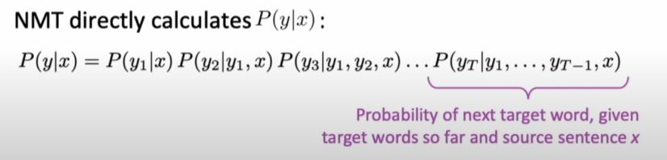
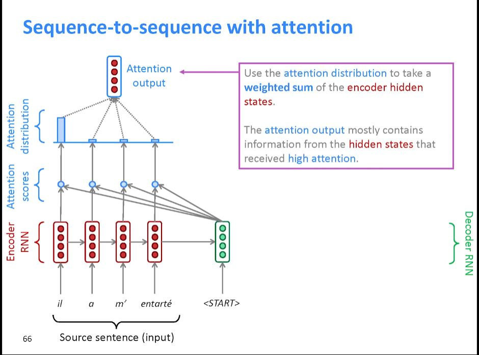
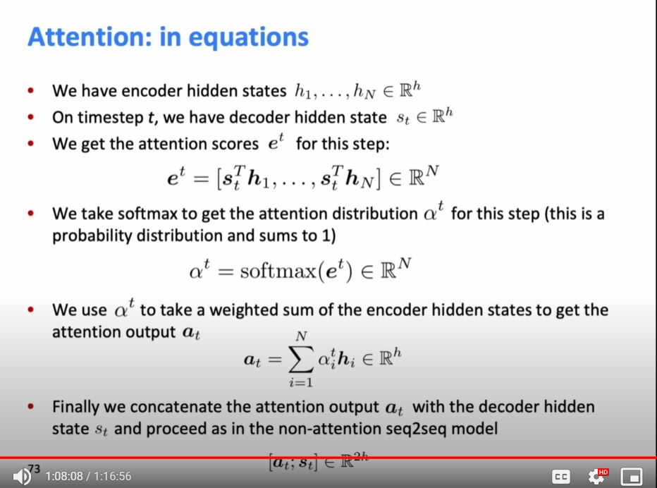

# Lecture 8: Translation, Seq2Seq, Attention

## Course Info

Website Link: http://web.stanford.edu/class/cs224n/index.html

Video Link: https://www.youtube.com/watch?v=XXtpJxZBa2c&list=PLoROMvodv4rOhcuXMZkNm7j3fVwBBY42z&index=8&ab_channel=stanfordonline

## Machine Translation

Task of translating a sentence x from one language (source language) to a 
sentence y in another language (target language)

First began in the 1950s as wanting to translate russian to english during the cold war. (keeping tabs on the russians).
These were mostly ruled based systems.

1990s-2010s: Statistical Machine Translation. Core idea is a probabilistic model from data

with Bayes Rule:

 

SMTs were extremely complex and was a huge research field. Engineers had to do a lot of feature engineering. Required
compiling and maintaining extra resources. Lots of human effort to maintain.

## Section 2: Neural Machine Translation

In 2014 was a groundbreaking year because of the introduction of NMT.

Neural network architecture is called sequence-to-sequence (aka seq2seq), and it involves two RNNs.

Encoder and Decoder: Encoder RNN produces encoding of source sentence while Decoder RNN generates target sentence 
conditioned on encoding. Involves two separate embeddings for source and target vocabulary.

This can be used for any sequence to sequence modeling

We use beam search for decoding due to computation cost

Problem with beam search is <end> tokens may be on different time steps 
(to solve this we use a fixed time step T to stop at)

The Biggest problem is there is a bias for shorter hypothesis (Beam search decoding)

Advantages of NMT:
1) Better Performance
2) Single neural network to be optimized end-to-end (No subcomponents to be individually optimized)
3) Requires much less human engineering effort

Disadvantages of NMT:
1) NMT is less interpretable 
2) NMT is difficult to control

## How do we evaluate Machine Translation?

BLEU (Bilingual Evaluation Understudy): compares the machine-written translation to one or several human-written 
translation(s), and computes a similarity score based on:
1) n-gram precision (usually for 1, 2, 3 and 4-grams)
2) Plus a penalty for too-short system translations

BLEU is useful but imperfect; there are many valid ways to translate a sentence. So a good translation can get a poor 
BLEU score because it has n-gram overlap with the human translation

You can call NMT the biggest success story of NLP Deep Learning: SMT systems, built by hundreds of engineers over many 
years, outperformed by NMT systems trained by a handful of engineers in a few months.

## Problems not solved yet

What if there are out-of-vocab words?

Domain Mismatch between train and test data

maintaining context over longer text

Low-resource language pairs

Common sense is hard (like paper jam translated can mean the food jam rather then printer jam)

Picks up bias in training data

Systems do strange things

## Attention

Information bottleneck in NMT: all encoding for the sentence must come from the last Encoder.

Attention provides a solution to the bottleneck problem

Core idea: on each step of the decoder, use direct connection to the encoder to focus on a particular part of the 
source sequence

First we will show via a diagram (no equations), then we will show with equations

 

Attention is great

Attention significantly improves NMT performance: allows a decoder to focus on certain parts of the source

Attention solves the bottleneck problem

Attention helps with the vanishing gradient problem: shortcut connection

Attention provides some interpretability: you can inspect attention distribution to see what decoder is focusing on 
(we get alignment for free! because we never explicitly trained for an alignment system, it learned it by itself)

Attention is a general Deep Learning technique

You can use it for more than just seq2seq

q, k, v way to understand attention

There are several attention variants:
1) Basic Dot-product
2) Multiplicative
3) Additive